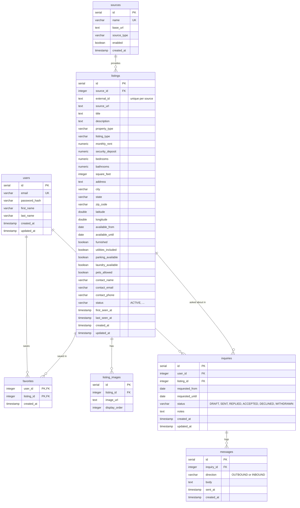

# AlgoRent ERD

The schema lives in the Flyway migrations at `backend/src/main/resources/db/migration`. `schema.sql` in this folder is the original V1 snapshot. GitHub renders the diagram below.

## Notes

- **Availability** is stored on the listing (`available_from`, `available_until`), not in a separate table. Each scraped listing has a single date window. If we later need several windows per listing (calendar sync), that becomes its own table.
- **Hosts are not users.** Listings come from other sites, so inquiries and messages belong to the guest. `messages.direction` records whether the guest sent the message or received it.
- **Deletes cascade** from users and listings to favorites, images, inquiries and messages.
- **Search indexes** (V2) are partial indexes on `lower(city)` for `ACTIVE` listings, combined with dates and with rent.
